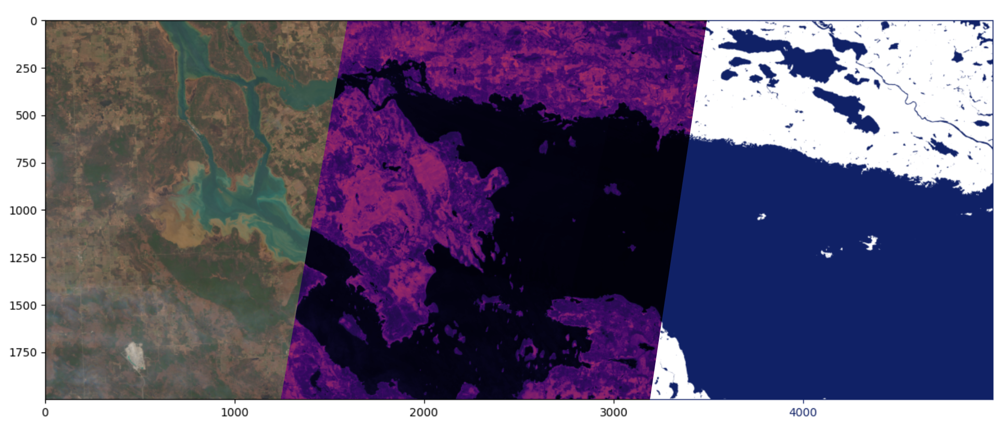

<!-- Improved compatibility of back to top link: See: https://github.com/othneildrew/Best-README-Template/pull/73 -->
<a name="readme-top"></a>


<!-- PROJECT LOGO -->
<br />
<div align="center">
  <a href="[https://github.com/captainbluebear/GEOL0069-ML-Inland-Water-Body-Detection]">
    
  </a>
</div>

<h1 align="center">Inland Water Body Detection with ML</h1>
<p align="center">
    Using k-means classification to analyse SENTINEL-2 satellite data for inland water bodies.
  </p>
<br />

<!-- TABLE OF CONTENTS -->
<details>
  <summary>Table of Contents</summary>
  <ol>
    <li>
      <a href="#about-the-project">About The Project</a>
      <ul>
        <li><a href="#background">Background</a></li>
        <li><a href="#the-sentinel-2-satellite">The SENTINEL-2 Satellite</a></li>
        <li><a href="#machine-learning-methodology">Machine Learning Methodology</a></li>
      </ul>
    </li>
    <li>
      <a href="#getting-started">Getting Started</a>
      <ul>
        <li><a href="#prerequisites">Prerequisites</a></li>
        <li><a href="#installation">Installation</a></li>
      </ul>
    </li>
    <li><a href="#usage">Usage</a></li>
    <li><a href="#roadmap">Roadmap</a></li>
    <li><a href="#contributing">Contributing</a></li>
    <li><a href="#license">License</a></li>
    <li><a href="#contact">Contact</a></li>
    <li><a href="#acknowledgments">Acknowledgments</a></li>
  </ol>
</details>


<!-- ABOUT THE PROJECT -->
# About The Project

This project is a final assignment for GEOL0069 at University College London, created to explore the usage of machine learning (ML) algorithms in Earth Sciences applications. It utilises unsupervised learning to detect and extract inland water bodies from satellite imagery. SENTINEL-2 data is used due to its high resolution and suitability. The algorithm used throughout this project is k-means classification.

## Background
Inland water bodies play a critical role in global ecology and climate. Consisting of lakes, reservoirs, rivers, and ephemeral waterbodies, they play an important role in many aspects of human society, including the economy, agriculture, and our environments. However, a combination of human activity and climate change has made these bodies of water highly susceptible to change in ways that may affect society. As a result, it is of great significance that inland water bodies are rapidly and accurately monitored (Zeng et al., 2023).

Remote sensing technology has been widely used in surface water body classification due to its global scale, availability, real-time nature, and low cost (Jiang et al., 2020). In comparison to traditional field methods, it is much less time-consuming and labour-intensive (Zeng et al., 2023). Much research has been conducted on how satellite imagery can best be utilised for effecting water body mapping. This project adds to that research by examining how data from the European SENTINEL-2 satellites can be utilised alongside machine learning algorithms to accurately detect inland water bodies.

<p align="right">(<a href="#readme-top">back to top</a>)</p>

## The SENTINEL-2 Satellite 
SENTINEL-2 is a European multi-spectral imaging mission, the purpose of which is to support a wide variety of applications including land management, forestry, and humanitarian relief operations. It consists of two satellites SENTINEL-2A and SENTINEL-2B which fly in the same orbit separated by 180 degrees. Both of the SENTINEL-2 satellites carry a single payload called the Multi-Spectral Instrument (MSI), which is an optical instrument that samples 13 spectral bands: four at 10m, six at 20m, and three at 60m spatial resolution (_Sentinel-2 - Overview_, n.d.).

### Multi-Spectral Instrument (MSI)
The MSI utilises a push-broom sensor to capture its data. Push-broom sensors work by collecting horizontal bands of image data as the satellite moves forward, building a band of spectral data along the path of the satellite (*Instrument Payload*, n.d.)

Light reflecting from the Earth’s surface is captured by the sensor and focused onto two focal plane assembles, one for Visible and Near Infrared bands and one for Short Wave Infrared bands. Each focal plane assembly contains 12 detectors with strip filters mounted on top which separate the wavelengths for each of the 13 bands (*Instrument Payload*, n.d.; *Satellite Description,* n.d.).

<p align="right">(<a href="#readme-top">back to top</a>)</p>

## Machine Learning Methodology — K-Means Clustering
The algorithm used throughout this project is K-means clustering, which works by partitioning a dataset into k clusters (groups), where k is some number set by the user. The basic idea is to define k centroids and assign each data point in the dataset to its nearest centroid, in such a manner as to keep the centroids as compact as possible within their respective clusters (*Unsupervised Learning — GEOL0069 Guide Book*, n.d.).

K-means is particularly well-suited for applications where the structure of the data is not known. Because K-means does not require any knowledge or input about the data, it is ideal for exploratory analysis. This makes it an ideal choice for this project.

### Key Components of K-Means

1. **Choosing K** - the number of centroids must be set before the algorithm can be applied.
2. **Centroid Initialisation** - How the centroids are initially placed can affect the result.
3. **Assignment** - Each data point in the dataset gets assigned to its nearest centroid based upon a calculation of squared Euclidian distance.
4. **Update** - The centroids are recomputed to fit the data points assigned to their respective cluster.
5. **Iterate** - The assignment and update steps are repeated until the centroids no longer move significantly, ensuring that the algorithm converges to a result.


<p align="right">(<a href="#readme-top">back to top</a>)</p>


<!-- GETTING STARTED -->
## Getting Started
This project was created in Google Colaboratory, a free online 

This is an example of how you may give instructions on setting up your project locally.
To get a local copy up and running follow these simple example steps.

### Prerequisites and Installation

This is an example of how to list things you need to use the software and how to install them.
* npm
  ```sh
  npm install npm@latest -g
  ```

### Datasets Used

1. Get a free API Key at [https://example.com](https://example.com)
2. Clone the repo
   ```sh
   git clone https://github.com/github_username/repo_name.git
   ```
3. Install NPM packages
   ```sh
   npm install
   ```
4. Enter your API in `config.js`
   ```js
   const API_KEY = 'ENTER YOUR API';
   ```

<p align="right">(<a href="#readme-top">back to top</a>)</p>


<!-- USAGE EXAMPLES -->
## Usage

Use this space to show useful examples of how a project can be used. Additional screenshots, code examples and demos work well in this space. You may also link to more resources.

_For more examples, please refer to the [Documentation](https://example.com)_

<p align="right">(<a href="#readme-top">back to top</a>)</p>


<!-- LICENSE -->
## License

Distributed under the MIT License. See `LICENSE.txt` for more information.

<p align="right">(<a href="#readme-top">back to top</a>)</p>


<!-- CONTACT -->
## Contact

Your Name - [@twitter_handle](https://twitter.com/twitter_handle) - email@email_client.com

Project Link: [https://github.com/github_username/repo_name](https://github.com/github_username/repo_name)

<p align="right">(<a href="#readme-top">back to top</a>)</p>


<!-- ACKNOWLEDGMENTS -->
## Acknowledgments

* []()
* []()
* []()

<p align="right">(<a href="#readme-top">back to top</a>)</p>


<!-- MARKDOWN LINKS & IMAGES -->
<!-- https://www.markdownguide.org/basic-syntax/#reference-style-links -->
[banner]: images/banner.png
